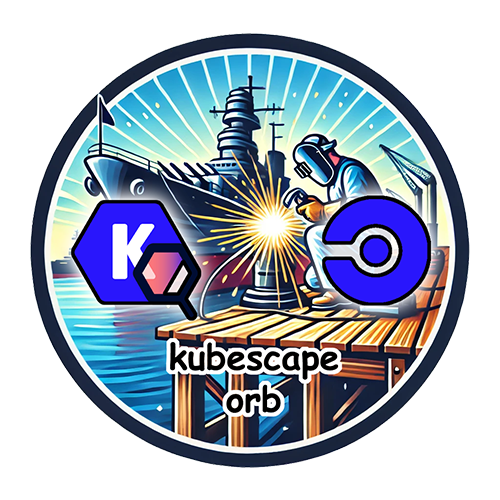

<div align="center">
  
  <h1>CircleCI Kubescape Orb</h1>
  <i>Harden your Kubernetes cluster with this orb for simplifying Kubescape installation and use within CircleCI.</i><br /><br />
</div>

[](https://circleci.com/gh/juburr/kubescape-orb) [](https://circleci.com/developer/orbs/orb/juburr/kubescape-orb) [](https://raw.githubusercontent.com/juburr/kubescape-orb/master/LICENSE) [](https://discuss.circleci.com/c/ecosystem/orbs)

This is an unofficial orb used to install Kubescape in your CircleCI pipeline and scan for security issues in Kubernetes. Contributions are welcome!

Scan Kubernetes YAML files and Helm charts in your CI pipeline using frameworks such as NSA, MITRE, SOC2, CIS, and more!

## Features
### **Secure By Design**
- **Least Privilege**: Installs to a user-owned directory by default, with no `sudo` usage anywhere in this orb.
- **Integrity**: Checksum validation of all downloaded binaries using SHA-512.
- **Provenance**: Installs directly from Kubescape's official [releases page](https://github.com/kubescape/kubescape/releases/) on GitHub. No third-party websites, domains, or proxies are used.
- **Confidentiality**: All secrets and environment variables are handled in accordance with CircleCI's [security recommendations](https://circleci.com/docs/security-recommendations/) and [best practices](https://circleci.com/docs/orbs-best-practices/).
- **Privacy**: No usage data of any kind is collected or shipped back to the orb developer.

Info for security teams:
- Required external access to allow, if running a locked down, self-hosted CircleCI pipeline on-prem:
  - `github.com`: For download and installation of the Kubescape tool.

## Example Usage

The following example assumes a Helm chart was built in a previous job, and saved to the workspace.

This example uses the NSA framework for demonstration purposes, but many organizations will elect to use "all" (the default, if not supplied).

```yaml
  version: 2.1

  orbs:
    kubescape: juburr/kubescape-orb@0.1.0

  jobs:
    helm_scan:
      docker:
        - image: cimg/base:current-22.04
      steps:
        - attach_workspace:
            at: /home/circleci/project/helm_charts
        - kubescape/install
        - kubescape/helm_scan_framework:
            chart_path: /home/circleci/project/helm_charts/myservice-1.0.0.tgz
            framework: nsa
            output_file: myservice_nsa_scan.json
            output_format: json
```
